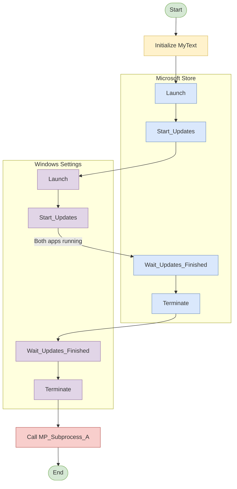
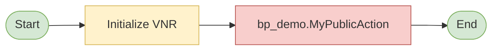
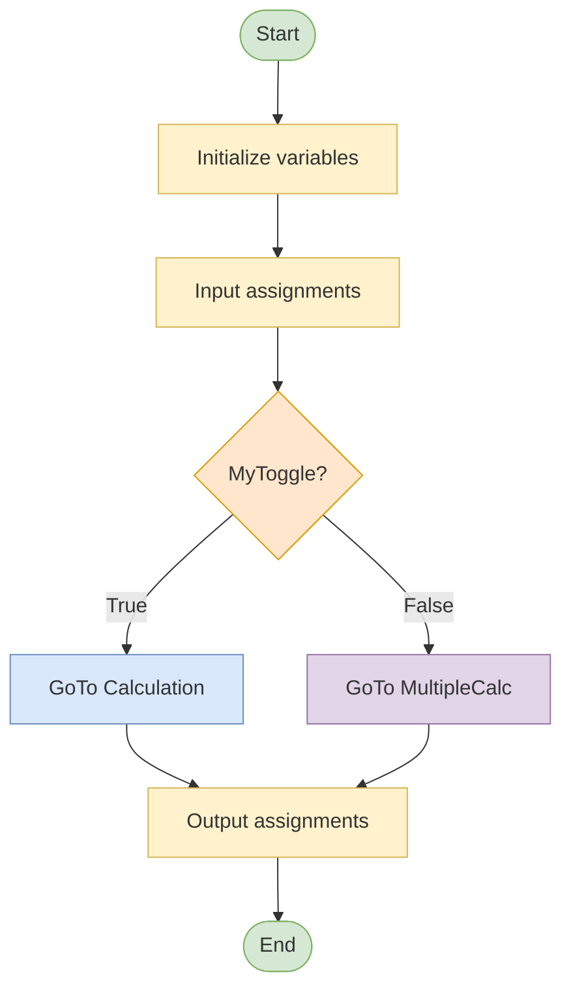

# MP - System Update - Process Flow Diagram

## Main Flow

## Dummy Page (Not called in Main)

## Variable_Test Page (Not called in Main) - GoTo Logic

---

## Process Description

### Main Flow
The main process:
1. Initializes `MyText = "Hallo Welt"`
2. Launches Microsoft Store, starts updates
3. Launches Windows Settings, starts updates
4. Waits for Microsoft Store updates to finish, then terminates
5. Waits for Windows Settings updates to finish, then terminates
6. Calls MP_Subprocess_A with the MyText parameter
7. Ends

### Dummy Page (Not called in Main)
- Initializes `VNR = "AB123456"`
- Calls bp_demo.MyPublicAction

### Variable_Test Page (Not called in Main)
- Demonstrates GoTo-based flow control
- Uses static MyToggle variable that retains value between calls
- Conditional branching with labels (Calculation vs MultipleCalc)

---

**Note:** This page demonstrates GoTo-based flow control using conditional branching with labels. The MyToggle variable is static, meaning it retains its value between calls.