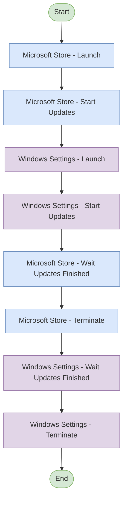

# MP - System Update - Process Flow Diagram

## Main Flow

---

## Process Description

### Main Flow
The process performs the following steps:
1. **Start** - Process begins
2. **Microsoft Store - Launch** - Launch the Microsoft Store application
3. **Microsoft Store - Start Updates** - Start the update process in Microsoft Store
4. **Windows Settings - Launch** - Launch Windows Settings application
5. **Windows Settings - Start Updates** - Start the update process in Windows Settings
6. **Microsoft Store - Wait Updates Finished** - Wait for Microsoft Store updates to complete
7. **Microsoft Store - Terminate** - Close the Microsoft Store application
8. **Windows Settings - Wait Updates Finished** - Wait for Windows Settings updates to complete
9. **Windows Settings - Terminate** - Close Windows Settings
10. **End** - Process completes

### Process Details
- **Name:** MP - System Update
- **Version:** 1.0
- **BluePrism Version:** 7.5.0.17125
- **Narrative:** Start Update of: Windows, Microsoft Store, Steam etc.

---

**Note:** This is a simple sequential flow with no conditional logic, subprocesses, or GoTo statements. Both applications run updates in sequence, with the Microsoft Store being terminated before waiting for Windows Settings updates to finish.
